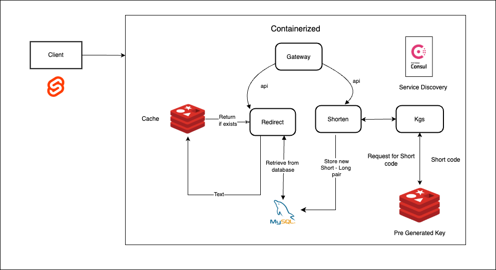

# ZapURL - URL Shortener

ZapURL is a high-performance, scalable URL shortener built with Go and a microservices architecture. It allows users to shorten long URLs and efficiently redirect to their original destinations. The project is containerized using Docker and supports distributed key generation for unique short URLs.

Hosted at: [zapurl.tech](https://www.zapurl.tech)

## Features

- **URL Shortening** - Generate short, unique URLs
- **Microservices Architecture** - Modular services for scalability
- **PostgreSQL** - Persistent database storage
- **Redis Bloom Filters** - Prevent duplicate short URLs
- **Consul Service Discovery** - Manage service communication
-  **Dockerized** - Easily deployable with Docker

## Architecture



## Tech Stack

- **Go** - Core backend logic
- **PostgreSQL** - Database storage
- **Redis + RedisBloom** - Caching and URL existence check
- **HashiCorp Consul** - Service discovery
- **Docker** - Containerized deployment
- **Svelte** - [Frontend](https://github.com/bikraj2/url_shortener_fronted) 

## Getting Started

### Prerequisites

- [Go](https://go.dev/)
- [Docker](https://www.docker.com/)

### Installation

1. Clone the repository:
   ```sh
   git clone https://github.com/bikraj2/zap_url.git
   cd zapurl
   ```

2. Set up the environment variables in `.envrc`.

3. Start the services using Docker:
   ```sh
   make run/docker
   ```

4. Run the services manually (optional):
   ```sh
   make run/shorten
   make run/redirect
   make run/kgs
   ```

## API Endpoints

| Method | Endpoint | Description |
|--------|---------|-------------|
| `POST` | `/api/v1/shorten` | Shorten a long URL |
| `GET`  | `/api/v1/resolve/{shortcode}` | Redirect to original URL |

Example request:
```sh
curl -X POST http://localhost:8081/api/v1/resolve/{shortcode} -d '{"url": "https://example.com"}' -H "Content-Type: application/json"
```

## Roadmap

- [ ] Implement **user authentication**
- [ ] Add **click tracking & analytics**
- [ ] Deploy using **Kubernetes**
- [ ] Add Custom short codes
## Contributing

Contributions are welcome! Feel free to open issues or submit pull requests.

## License

This project is licensed under the MIT License.

---

 **Have suggestions?** Open an issue or drop me a message!

